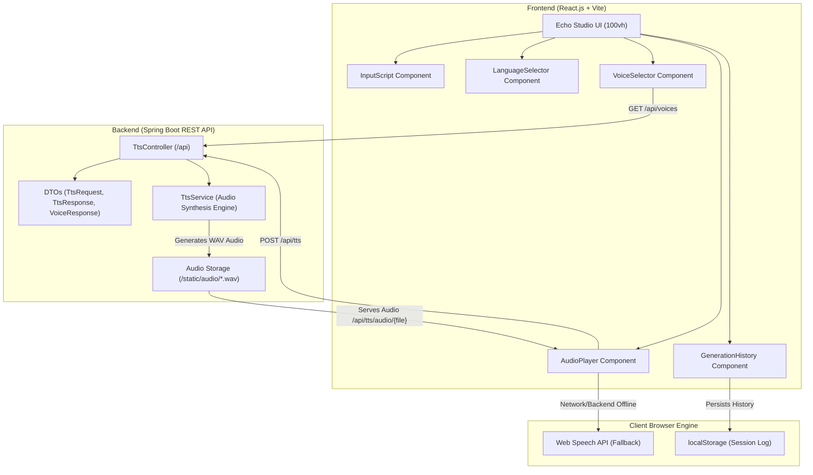

# 🎙️ Echo Studio — Full-Stack Text-to-Speech Application

Echo Studio is a production-ready, full-stack Text-to-Speech (TTS) web application built with a **Java 17 Spring Boot REST API backend** and a **React.js (Vite) frontend**. It provides a single-screen (100vh) audio production interface featuring multilingual voice synthesis, fine-grained speech controls, audio visualizer, download capabilities, and a persistent generation history session log.

---

## 🌟 Key Features

- ⚡ **Single-Screen 100vh Layout**: A non-scrolling UI designed for maximum screen utilization.
- 🎨 **Warm Amber-on-Charcoal Aesthetics**: Crafted with Space Grotesk & Plus Jakarta Sans typography, sleek dark mode cards, and sound-motif animations.
- 🗣️ **Multilingual Voice Support**: Filter voices across multiple languages including English (US & UK), Hindi, Gujarati, Marathi, Spanish, French, and German.
- 🎛️ **Speech Delivery Controls**: Fine-tune speaking speed (0.5x to 2.0x) and voice pitch (0.5x to 1.5x) with instant preview.
- 📜 **Interactive Session History**: Logs recent audio clips with script snippets, voice tags, timestamps, and mini replay buttons (persisted in `localStorage`).
- 🎵 **Full Audio Player**: Integrated waveform audio visualizer, time scrubber, volume control, and `.wav` file downloader.
- 🛡️ **Dual-Engine Speech Synthesis**: High-quality Spring Boot backend WAV synthesizer with seamless automatic fallback to browser Web Speech API.

---

## 🏗️ Architecture Diagram



---

## 🛠️ Technology Stack

| Layer | Technologies & Tools |
| :--- | :--- |
| **Frontend** | React 18, Vite, Vanilla CSS3 (Custom Design System Tokens), Web Speech API |
| **Backend** | Java 17, Spring Boot 3.x, Maven, Spring Web |
| **Typography** | Space Grotesk (Headings), Plus Jakarta Sans (Body), JetBrains Mono (Counters) |
| **Audio** | Java Audio PCM Synthesizer, HTML5 Audio API |

---

## 🚀 Getting Started

### Prerequisites

- **Java JDK**: Version 17
- **Node.js**: Version 18+
- **Maven**: Version 3.8+

---

### 1. Run the Backend (Spring Boot API)

Navigate to the `backend` directory and run the Maven command using Java 17:

```powershell
# Windows PowerShell
$env:JAVA_HOME="C:\Program Files\Java\jdk-17"
Set-Location backend
mvn spring-boot:run
```

The Spring Boot backend will start on **`http://localhost:8080`**.

#### Backend API Endpoints:

- `GET /api/health` — Health check endpoint returning backend status.
- `GET /api/voices` — Returns list of available voice models and sample texts.
- `POST /api/tts` — Synthesizes input text into speech. Returns JSON with audio URL.
- `GET /api/tts/audio/{filename}` — Serves generated `.wav` audio files.

---

### 2. Run the Frontend (React Studio UI)

Open a new terminal window, navigate to the `frontend` directory, and start the Vite dev server:

```powershell
Set-Location frontend
npm install
npm run dev
```

The React frontend application will open on **`http://localhost:5173`**.

---

## 📁 Project Structure

```text
TTS-Application/
├── backend/
│   ├── src/main/java/com/example/tts/
│   │   ├── TtsApplication.java             # Spring Boot Application Entry Point
│   │   ├── controller/
│   │   │   └── TtsController.java          # REST API Controllers (/api/tts, /api/voices, /api/health)
│   │   ├── service/
│   │   │   └── TtsService.java             # Audio Synthesis Engine & Voice Registry
│   │   ├── dto/
│   │   │   ├── TtsRequest.java             # Synthesis Request DTO
│   │   │   ├── TtsResponse.java            # Synthesis Response DTO
│   │   │   ├── VoiceResponse.java          # Voice Details DTO
│   │   │   └── ErrorResponse.java          # Error Handling DTO
│   │   └── exception/
│   │       └── GlobalExceptionHandler.java # REST Controller Exception Handler
│   └── pom.xml                             # Maven Dependencies (Java 17)
│
├── frontend/
│   ├── src/
│   │   ├── components/
│   │   │   ├── Header.jsx                  # Clean Top Navigation & Sound Ring Motif
│   │   │   ├── TextInput.jsx               # Script Input, Word Counter & Character Limit
│   │   │   ├── LanguageSelector.jsx        # Multilingual Filter Pills
│   │   │   ├── VoiceSelector.jsx           # Voice Model Dropdown, Speed & Pitch Sliders
│   │   │   ├── AudioPlayer.jsx             # Audio Player, Scrubber, Volume & Visualizer
│   │   │   ├── GenerationHistory.jsx       # Session History Log List
│   │   │   └── ErrorMessage.jsx            # Alert Banner Component
│   │   ├── App.jsx                         # Main Application State & Layout
│   │   ├── App.css                         # Design Tokens & 100vh Grid Styling
│   │   └── main.jsx                        # React Root Entry Point
│   ├── index.html                          # HTML5 Entry Point & Font Imports
│   └── package.json                        # Vite & React Dependencies
│
└── README.md                               # Project Documentation
```

---

## 📄 License

This project is open-source and available under the [MIT License](LICENSE).
